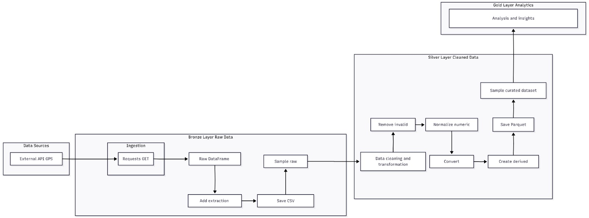

# Big Data Project - Mobilidade SPPO

Projeto de ingestao e tratamento de dados de GPS do sistema de onibus (SPPO), com foco em preparar dados para analises de mobilidade urbana.

## Visao geral

O pipeline atual:

1. Consome dados da API publica de mobilidade do Rio.
2. Salva uma camada bruta (raw) em CSV.
3. Aplica transformacoes e limpeza (camada silver).
4. Gera amostras para analise e validacao rapida.

Fonte de dados utilizada: `https://dados.mobilidade.rio/gps/sppo`

## Estrutura do repositorio

- `codigo/ingestao_av1_big_data.ipynb`: notebook principal com ingestao, limpeza e transformacoes.
- `dados/amostra_gps_sppo_bruto.csv`: amostra da camada bruta.
- `dados/sppo_amostra.csv`: amostra tratada (silver).

## Stack e tecnologias

- Python (Jupyter Notebook / Google Colab)
- Bibliotecas: `pandas`, `requests`, `pytz`, `datetime`, `os`
- Formatos de saida: CSV e Parquet

## Arquitetura e fluxo de dados

- **Ingestao (raw):** requisicao HTTP para a API SPPO e montagem de DataFrame.
- **Persistencia raw:** salvamento dos dados originais e criacao de amostra.
- **Transformacao temporal:** conversao de timestamp Unix (ms) para `datetime` com timezone.
- **Enriquecimento:** criacao de colunas derivadas (`data`, `hora`, `minuto`, `dia_semana`, metricas de latencia).
- **Qualidade/limpeza:** padronizacao de tipos, tratamento de decimais, remocao de nulos criticos, filtros de coordenadas e velocidade.
- **Saida silver:** exportacao do dataset tratado (CSV/Parquet) e amostra final.

## Pre-requisitos

- Python 3.10+ (recomendado)
- Jupyter Notebook ou JupyterLab

## Instalacao

No diretorio raiz do projeto:

```bash
python -m venv .venv
```

Ative o ambiente virtual:

- **Windows (PowerShell):**

```powershell
.venv\Scripts\Activate.ps1
```

Instale as dependencias:

```bash
pip install jupyter pandas requests pytz pyarrow
```

## Como executar

1. Inicie o Jupyter:

```bash
jupyter notebook
```

2. Abra `codigo/ingestao_av1_big_data.ipynb`.
3. Execute as celulas em ordem, do inicio ao fim.

## Configuracao atual

Hoje, parte das configuracoes esta hardcoded no notebook:

- URL da API: `https://dados.mobilidade.rio/gps/sppo`
- Fusos utilizados no processamento
- Tamanho de amostras (raw e silver)
- Caminhos de saida (incluindo referencias a `/content/...`, tipico de Colab)

Para execucao local, recomenda-se ajustar caminhos para o projeto, por exemplo:

- `dados/raw/`
- `dados/silver/`

## Dados gerados

- Camada bruta (raw): dados coletados diretamente da API.
- Camada tratada (silver): dados com colunas temporais e filtros de qualidade aplicados.
- Arquivos de amostra:
  - `dados/amostra_gps_sppo_bruto.csv`
  - `dados/sppo_amostra.csv`

## Regras de qualidade aplicadas

- Conversao de campos numericos com separador decimal.
- Conversao de timestamps para formato de data/hora.
- Remocao de registros com nulos em campos criticos.
- Filtro de coordenadas fora de faixa valida.
- Filtro de velocidade negativa.

## Limitacoes conhecidas

- Dependencia de disponibilidade da API externa.
- Ausencia de arquivo de dependencias versionado (`requirements.txt`/`pyproject.toml`).
- Ausencia de testes automatizados e lint configurado.
- Caminhos acoplados ao Colab em partes do notebook.

